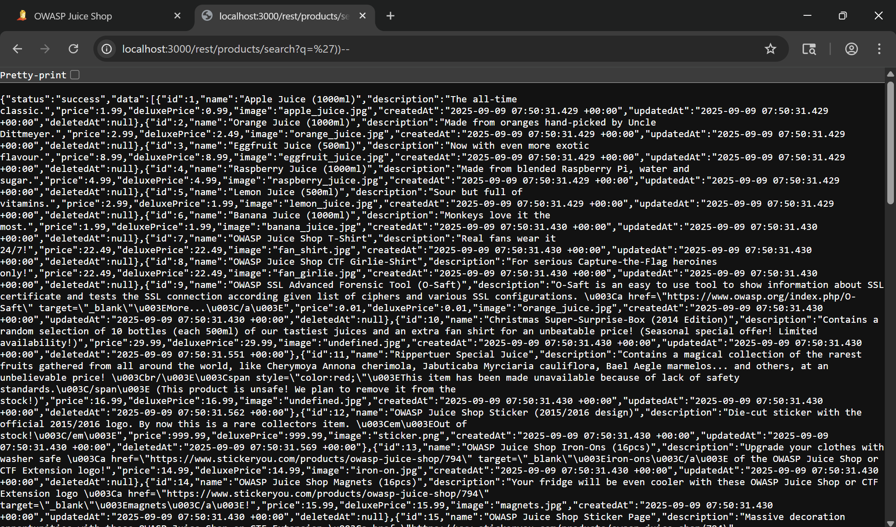
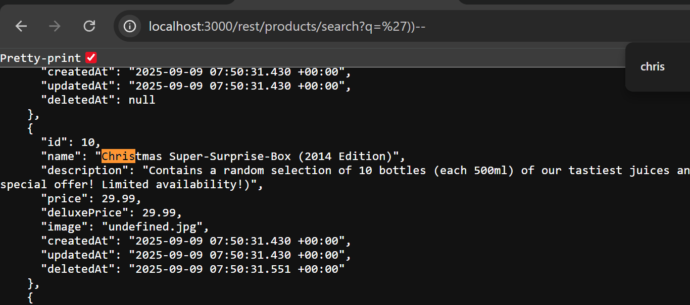
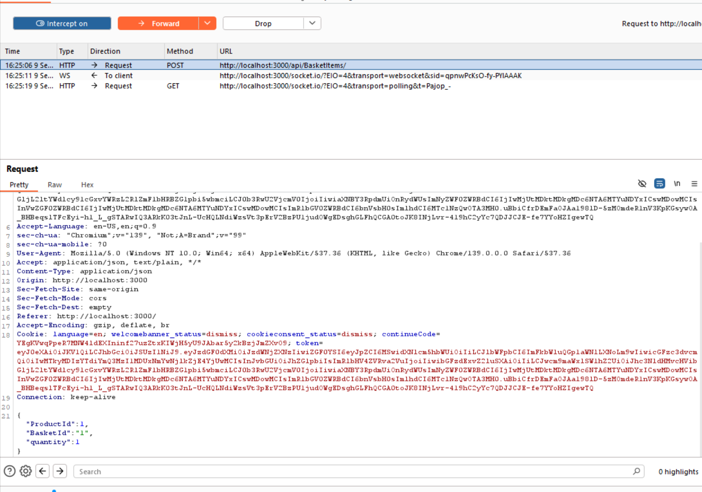
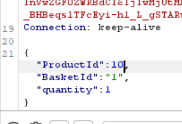
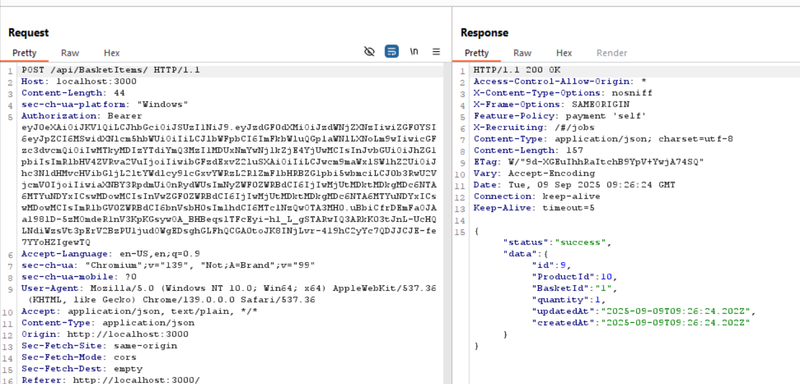
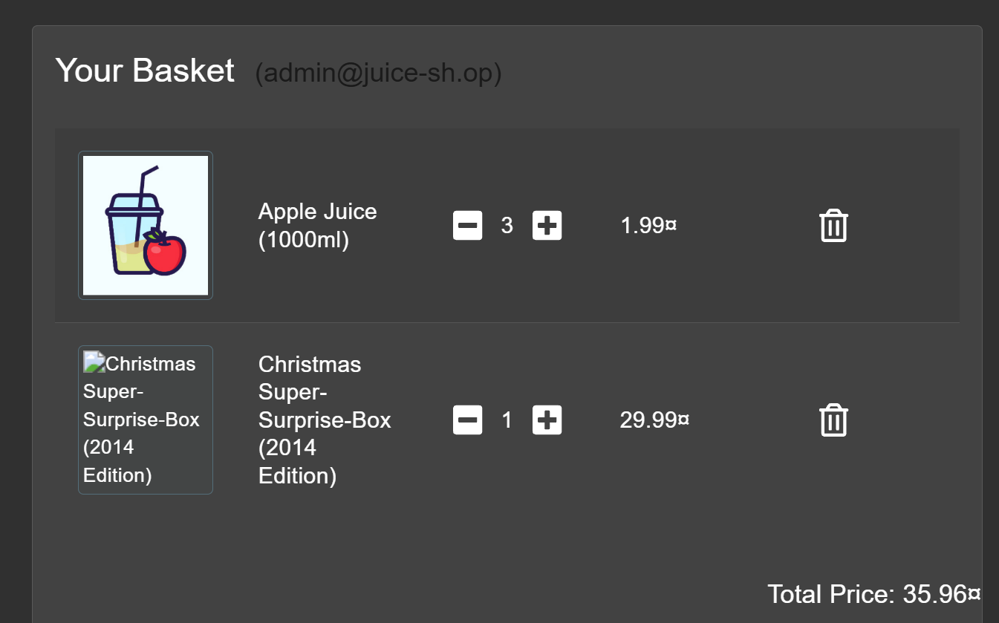

# Christmas Special - OWASP Juice Shop
Website: [OWASP Juice Shop - Injection](https://demo.owasp-juice.shop/#/score-board?categories=Injection)

## Soal <br>
Order the Christmas special offer of 2014.

## Step-by-step 
1. Dari challenge sebelumnya kita bisa tahu bahwa url search dapat dimanipulasi dengan menggunakan SQL Injection. Disini saya menambahkan  ```'))--``` setelah url products dan muncul semua list product termasuk yang tidak ditampilkan di website.
2. Karena tujuannya adalah mencari christmast special offer maka saya langsung mencari dengan CTRL F dan muncul data produknya dengan **id=10**.
3. Makadari itu saya login dengan akun Admin dan intercept menggunakan BurpSuite lalu mencoba untuk menambahkan product random ke keranjang agar muncul endpointnya di BurpSuite. 
Setelah muncul maka saya forward karena kita membutuhkan metode POST agar bisa menambahkan produk Christmas ke cart.
4. Setelah forward di intercept dan metodenya berubah jadi POST maka saya *Send to Repeater* lalu mengubah **"productId"** menjadi 10
5. Muncul response di sebelah kanan yang menunjukkan bahwa product tersebut berhasil ditambahkan ke cart.
6. Lanjut untuk di checkout dan kita berhasil solve soal ini. 
