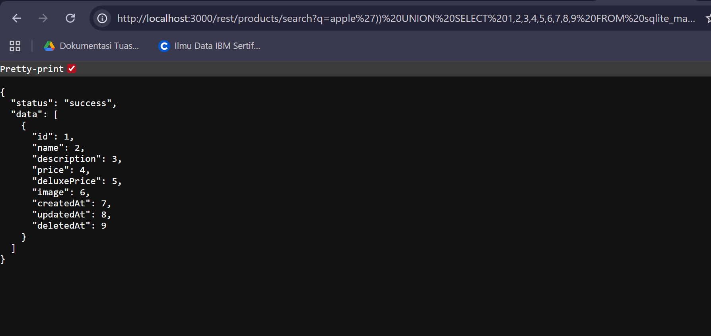

# Database Schema - OWASP Juice Shop
Website: [OWASP Juice Shop - Injection](https://demo.owasp-juice.shop/#/score-board?categories=Injection)

## Description <br>
Exfiltrate the entire DB schema definition via SQL Injection.

## Step-by-step 
1. Karena kita butuh memasukkan query maka kita cari cara untuk input.
2. Setelah melihat alur network ditemukan ternyata pada baris search bisa dimanipulasi. ```http://localhost:3000/rest/products/search?q=```
3. Maka saya mencoba untuk menjalankan query kosong untuk testing apakah dia berfungsi. Dan setelah menjalankan ```apple'))--``` muncul status success yang berarti kita berhasil untuk menjalankan query. 
4. Disini saya coba untuk menampilkan kolom satu hingga 9 dengan menambahkan ```apple')) UNION SELECT 1,2,3,4,5,6,7,8,9 FROM sqlite_master --``` ke network url search tadi. 
5. Lalu dengan tambahan ini ```apple')) UNION SELECT sql,2,3,4,5,6,7,8,9 FROM sqlite_master --``` maka kita berhasil menampilkan databasenya.
## Coding Challenge
### Find It


### Fix It
