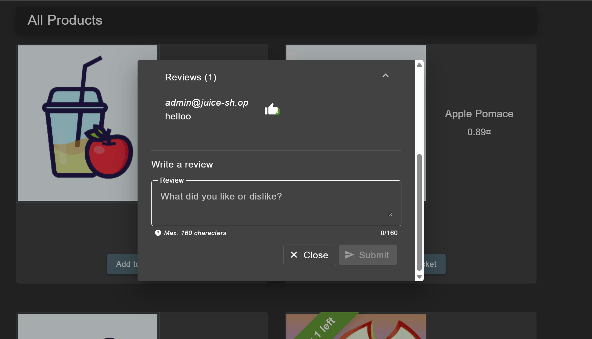
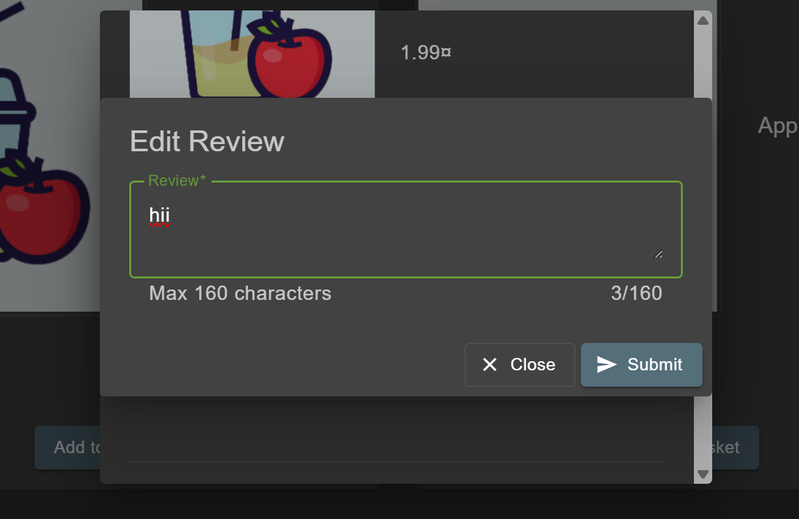
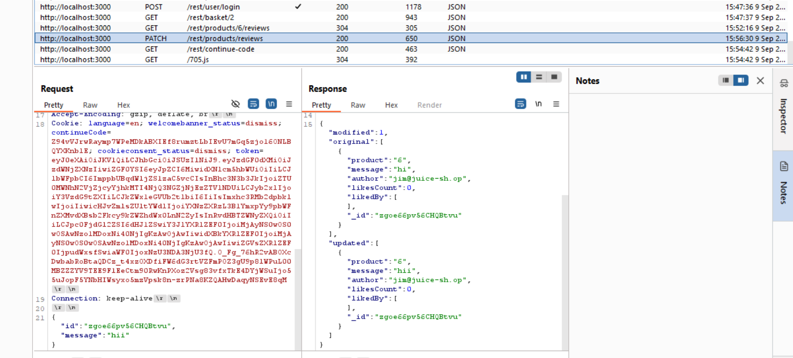
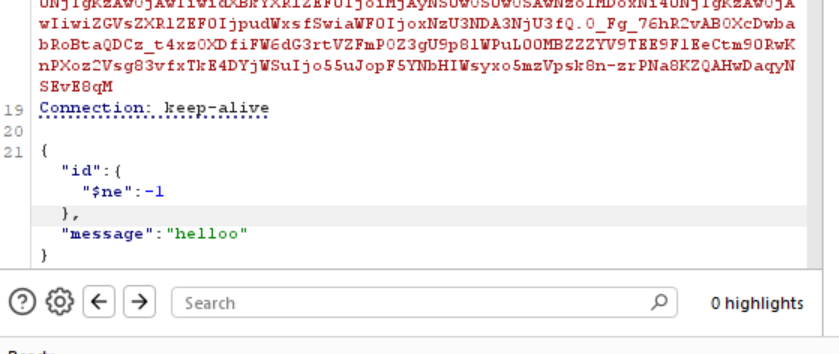
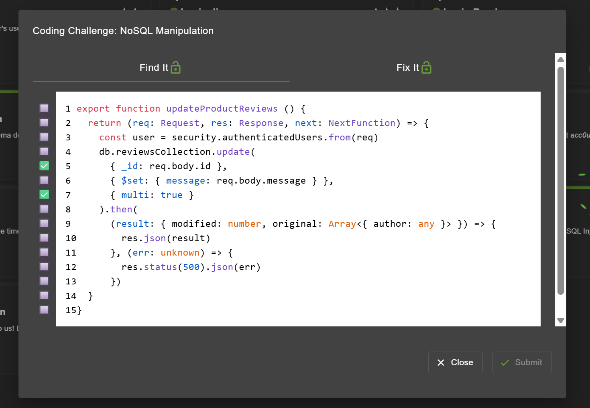
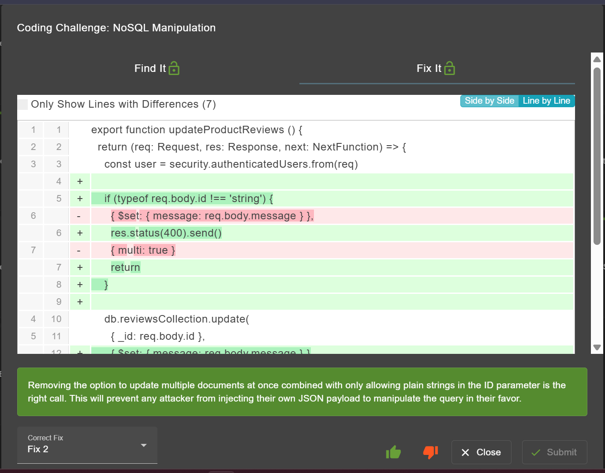

# NoSQL Manipulation - OWASP Juice Shop
Website: [OWASP Juice Shop - Injection](https://demo.owasp-juice.shop/#/score-board?categories=Injection)

## Description <br>
Update multiple product reviews at the same time.

## Step-by-step 
1. Coba untuk menuliskan review sebagai Admin pada prodyct random. 
2. Setelah review disubmit ternyata kita bisa mengedit review tersebut.
3. Dan ketika dicek menggunakan BurpSuite terdapat endpoint ```/rest/products/reviews dengan metode PATCH yang biasa digunakan untuk mengupdate. 
4. Maka dari itu langsung saja saya Send to Repeater dan coba untuk mengupdate message nya menjadi **helloo**
```sql
{
    "id":{"$ne":-1},
    "message": "helloo"
}
```


5. Setelah dijalankan muncul semua reviews yang telah berhasil terupdate. 

## Coding Challenge
### Find It

### Fix It


