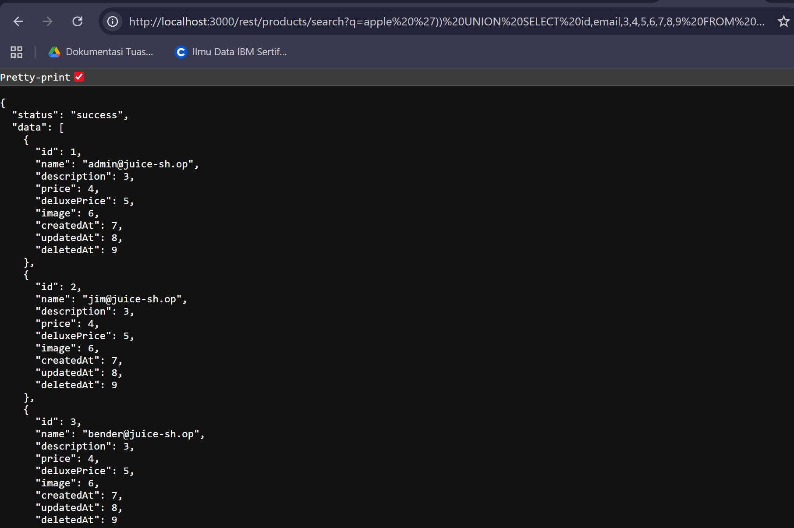
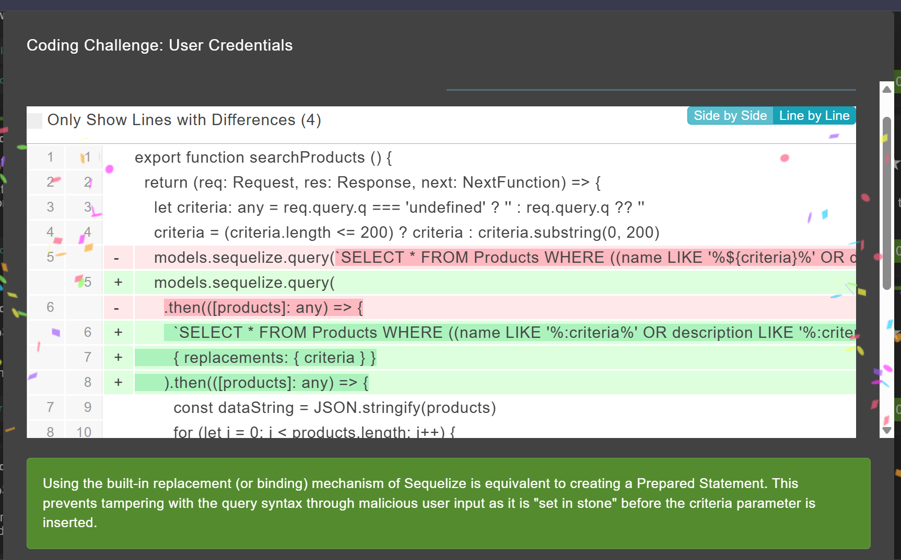

# User Credentials - OWASP Juice Shop
Website: [OWASP Juice Shop - Injection](https://demo.owasp-juice.shop/#/score-board?categories=Injection)

## Soal <br>
Retrieve a list of all user credentials via SQL Injection.

## Step-by-step 
1. Menggunakan metode yang kurang lebih sama dengan challenge Database Schema namun mengganti query nya dengan ``` apple ')) UNION SELECT 1,2,3,4,5,6,7,8,9 FROM users--``` agar bisa menampilkan kolom yang ada pada tabel users. 
2. Lalu ganti kolom 1 dengan **id** dan 2 dengan **name** agar bisa menampilkan nama user. Namun ternyata menampilkan error message yang menunjukkan bahwa kolom name tidak ada.
```')) UNION SELECT id,name,email,4,5,6,7,8,9 FROM users--```  
3. Ketika coba menggantu kolom kedua dengan **email** maka muncul list email dari user yang terdaftar.
4. Lalu saya mencoba lagi dengan mengganti kolom keempat dengan **password** dan muncul password yang ter encrypt pada  **description**  

## Coding Challenge
### Find It

### Fix It

