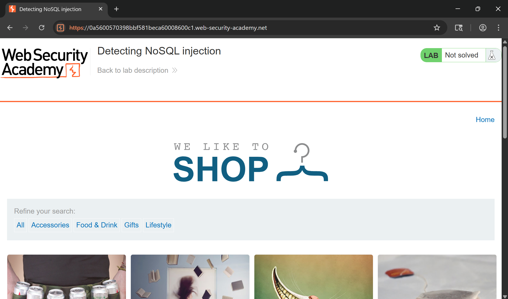
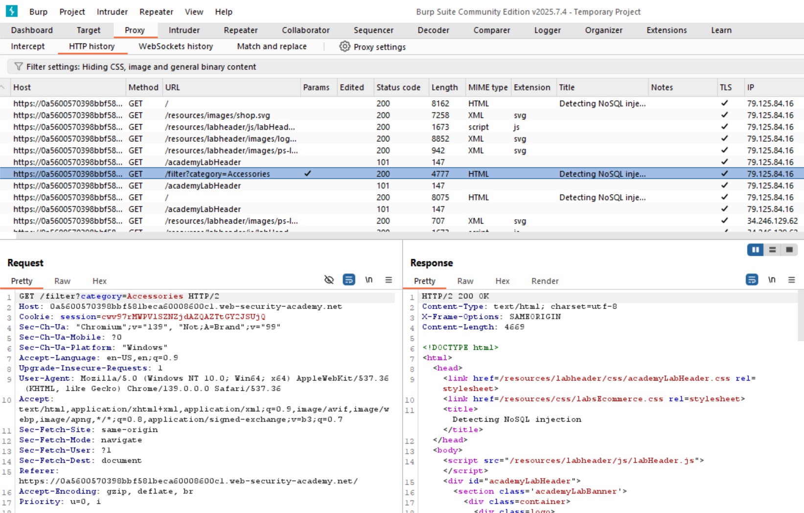
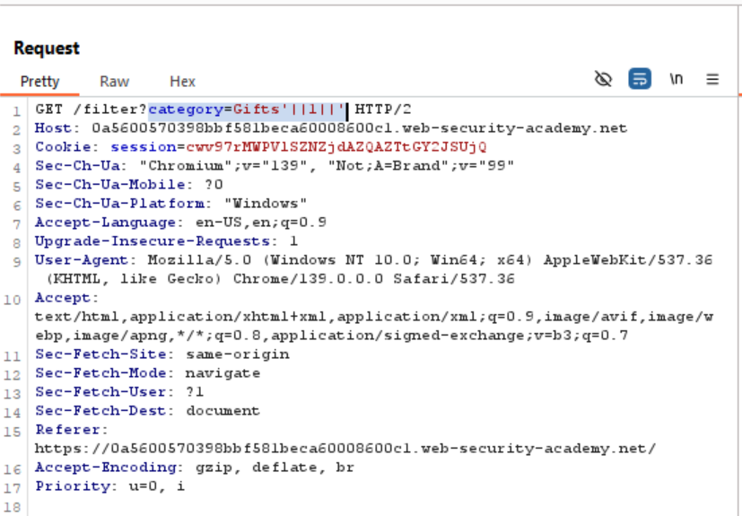
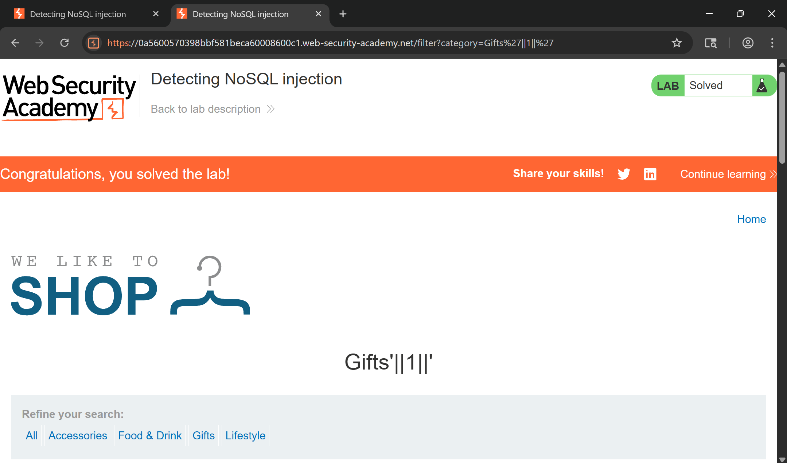

# Detecting NoSQL Injection - PortSwigger
Website: [PortSwigger](https://portswigger.net/web-security/nosql-injection/lab-nosql-injection-detection)

## Description <br>
The product category filter for this lab is powered by a MongoDB NoSQL database. It is vulnerable to NoSQL injection.

To solve the lab, perform a NoSQL injection attack that causes the application to display unreleased products.

## Step-by-step 
1. Muncul web shop ketika launch di instance dan kita diminta untuk menampilkan semua kategori.
2. Maka langsung kita gunakan BurpSuite dan mencari endpoint yang ada unsur category nya. Ditemukan endpoint dengan ```/filter?category=Accessories``` 
3. Langsung *Send to Repeater* dan ganti category nya menjadi ```Gifts'||1||'``` agar menampilkan semua product di category yang ada dan mengabaikan category Gifts itu sendiri. 

4. Lab ini pun berhasil tersolve. 