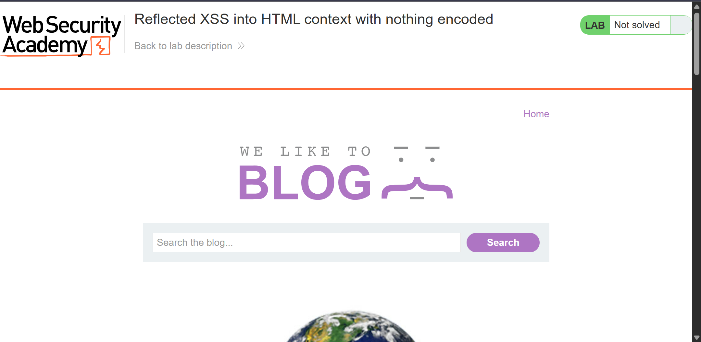
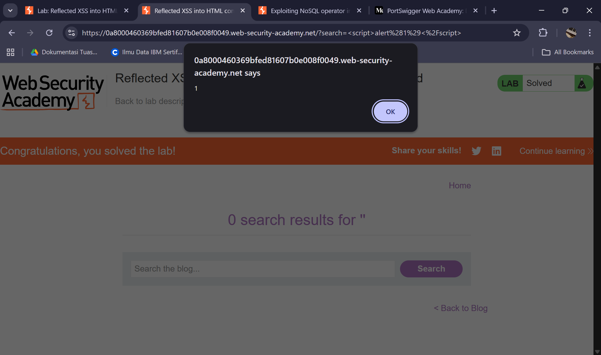

# Reflected XSS into HTML context with nothing encoded - PortSwigger
Website: [PortSwigger](https://portswigger.net/web-security/cross-site-scripting/reflected/lab-html-context-nothing-encoded)

## Description <br>
This lab contains a simple reflected cross-site scripting vulnerability in the search functionality.

To solve the lab, perform a cross-site scripting attack that calls the alert function.


## Step-by-step 
1. Saat  launch instance muncul web seperti blog. Pada description kita sudah diberi clue untuk menampilkan alert dengan injection.

2. Kita coba dengan script alert sederhana untuk menampilkan angka 1 yaitu ```<script>alert(1)</script>``` dan ternyata berhasil muncul alert, challenge pun ter solve.  